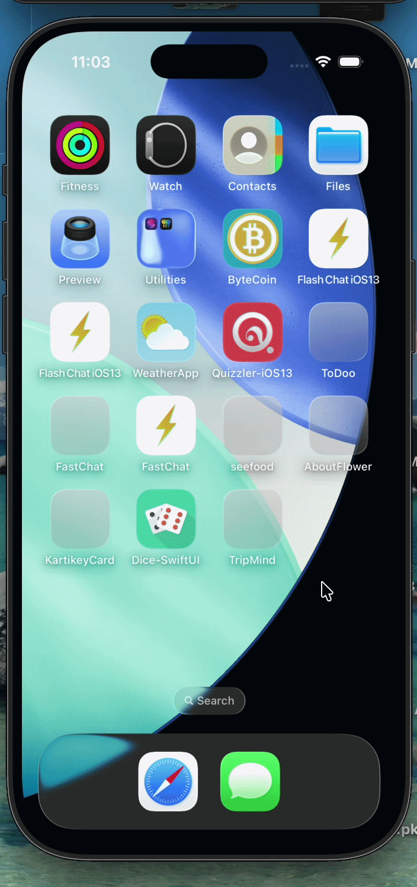

# TripMind ✈️

A smart iOS travel companion app built with SwiftUI that helps you plan trips and never forget what to pack.


## Features

- 🗺️ **Trip Creation** — Create trips with destination, dates, and trip type
- 🧳 **Smart Packing List** — Auto-generated packing suggestions based on trip type
- 🤖 **AI Packing Assistant** — Describe your trip in plain text and get personalized packing suggestions powered by Gemini AI
- ✅ **Packing Progress** — Track what's packed with a visual progress bar
- 💾 **Persistent Storage** — All trips and packing items saved locally using CoreData
- 🗑️ **Full CRUD** — Add, check off, and delete packing items and trips

## Tech Stack

| Technology | Usage |
|------------|-------|
| SwiftUI | UI Framework |
| CoreData | Local Persistence |
| MVVM | Architecture Pattern |
| Gemini AI API | AI Packing Suggestions |
| URLSession + async/await | Networking |
| UserNotifications | (Coming Soon) |
| WidgetKit | (Coming Soon) |

## Screenshots

> Coming soon

## Architecture
```
TripMind/
├── Model/
│   └── Trip.swift               # Data models (Trip, PackingItem, TripType)
├── Views/
│   ├── CreateTripView.swift     # Trip creation screen
│   └── PackingListView.swift    # Packing list with AI button
├── ViewModels/
│   └── TripViewModel.swift      # Business logic + CoreData operations
├── Services/
│   └── AIPackingService.swift   # Gemini AI API integration
├── coreData/
│   └── PersistenceController.swift
└── ContentView.swift            # Home screen with trip list
```

## Getting Started

### Prerequisites
- Xcode 15+
- iOS 17+
- Gemini API Key (free at [aistudio.google.com](https://aistudio.google.com))

### Setup

1. Clone the repo
```bash
   git clone https://github.com/Kval25/TripMind.git
```

2. Open `TripMind.xcodeproj` in Xcode

3. Create a `Secrets.swift` file inside the TripMind folder:
```swift
   enum Secrets {
       static let geminiAPIKey = "YOUR_GEMINI_API_KEY_HERE"
   }
```

4. Run the app on simulator or device (`Cmd + R`)

## AI Feature

The AI Packing Assistant uses Google Gemini API to suggest personalized packing items based on your trip description.

**How to use:**
1. Open any trip
2. Tap the **✨ AI** button in the top right
3. Describe your trip in plain text
4. Tap **Suggest Items**
5. Items are automatically added to your packing list

> Note: `Secrets.swift` is excluded from this repo for security. You need to create it yourself with your own API key.

## What I Learned

- SwiftUI fundamentals and component-based UI design
- MVVM architecture pattern in iOS
- CoreData for persistent local storage
- REST API integration using URLSession and async/await
- Gemini AI API integration
- Git best practices including secret management

## Roadmap

- [ ] WidgetKit — currency converter home screen widget
- [ ] MapKit — offline trip notes with map pins
- [ ] Trip Memory Wall — photo memories after the trip
- [ ] Push Notifications — packing reminders before trip date

## Author

Built by a passionate iOS developer as a portfolio project.

[](https://linkedin.com/in/yourprofile)
[](https://github.com/Kval25)
